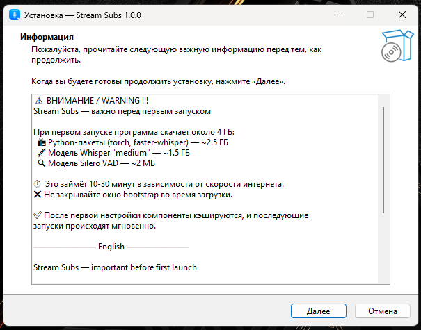
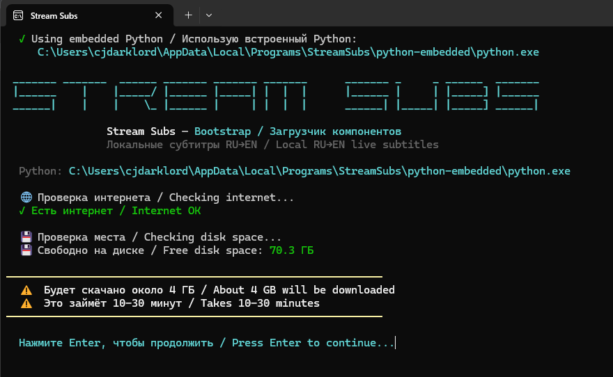
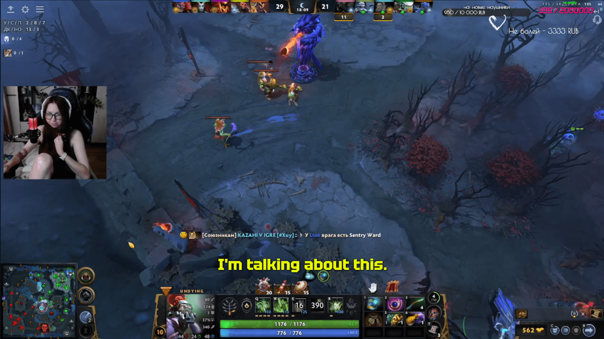
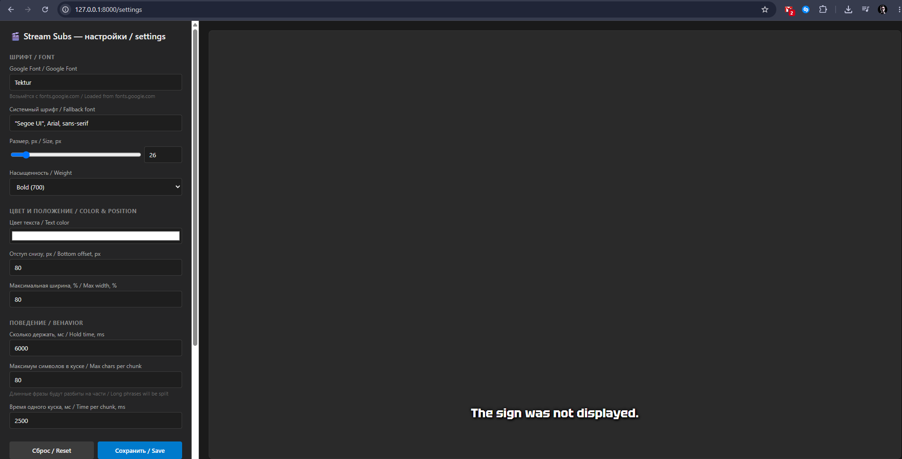

# Stream Subs 🎙️

**Local RU→EN live subtitles for streams powered by Whisper + CUDA**

[🇷🇺 Russian version](README.md)

---

**Stream Subs** is a local live subtitle app for streamers. It translates Russian speech into English subtitles in real time and displays them over your stream in OBS or Streamlabs.

**Everything runs on your computer** — no cloud services, no monthly fees, no limits.

---

## ✨ Features

- 🎤 **Microphone → English subtitles** in real time
- ⚡ **GPU acceleration** via CUDA (0.3–0.7s latency)
- 🎨 **Web-based settings UI** with Google Fonts support
- 🚫 **Hallucination and banned words filter** (for stream safety)
- 📝 **Full logging** of every transcription (for audit)
- 🌍 **Bilingual interface** (RU + EN)
- 📦 **One-click installer** — no Python required for end users
- 💾 **Editable word lists** for banned words and memes

---

## 📊 Architecture

~~~~
Microphone → VAD → Whisper (ru→en) → WebSocket → Browser → OBS/Streamlabs
~~~~

- **VAD** (Voice Activity Detection) — Silero VAD for phrase splitting
- **Whisper** — `medium` model via `faster-whisper` (CTranslate2 + CUDA)
- **Web server** — FastAPI + WebSocket for subtitle delivery
- **Frontend** — HTML + CSS + JS, supports Google Fonts
- **Installer** — Inno Setup with bootstrap dependency loading

---

---

## 📸 Screenshots

|  |  |
| :---: | :---: |
| Inno Setup installer | Component download (bootstrap) |

|  |  |
| :---: | :---: |
| Subtitles in OBS / Streamlabs | Web settings UI |

---

## 📥 Installation

### Ready installer (recommended)

1. Download **StreamSubsSetup.exe** from the [Releases](https://github.com/CJDARKLORD/Stream-Subs/releases/latest) page.
2. Run the installer.
3. Follow the instructions. Installation takes 1–2 minutes.
4. **On first launch** the app will download about 4 GB of components:
   - Python packages (torch, faster-whisper, silero-vad) — ~2.5 GB
   - Whisper `medium` model — ~1.5 GB
   - Silero VAD model — ~2 MB
5. Wait for **"ALL COMPONENTS READY!"** — this takes 10–30 minutes.
6. Open `http://127.0.0.1:8000` in your browser or add it as a **Browser Source** in OBS/Streamlabs.

### Requirements

- Windows 10 / 11 (x64)
- NVIDIA GPU with CUDA support (GTX 1060+ / RTX 2060+ recommended)
- 6 GB free disk space
- Internet for the first launch

### Building from source

Open a terminal and run:

- `git clone https://github.com/CJDARKLORD/Stream-Subs.git`
- `cd Stream-Subs`
- `py -3.11 -m venv .venv`
- `.venv\Scripts\activate`
- `pip install -r requirements.txt`
- `python main.py`

**Build requirements:** Python 3.11+, PyInstaller, Inno Setup 6.

---

## 🎮 CPU build

If you **don't have an NVIDIA GPU**, the app will still work — Whisper will automatically fall back to CPU (`Whisper: cpu / int8`).

**But:** on CPU the `medium` model processes a phrase in **1–3 seconds** instead of 0.3–0.7, which is noticeable for live subtitles. Latency between phrases also increases.

### Options for CPU

**1. Build an optimized CPU build yourself.**

In the `bootstrap.py` build command, remove the `--collect-all nvidia` and `--exclude-module nvidia` flags. The installer size will drop from ~40 MB to ~25 MB, and the total size on disk — from 4 GB to ~1.5 GB.

**2. Use a smaller model.**

In `main.py`, replace `MODEL = "medium"` with `MODEL = "small"` or `MODEL = "base"`. Speed will increase 2–4×, translation quality will drop.

**3. Ask the author to build a CPU version.**

If you don't want to build it yourself — create an [Issue](https://github.com/CJDARKLORD/Stream-Subs/issues) titled **"Request: CPU build"**. The author will publish a ready CPU installer in Releases if there is enough demand.

---

## 🎬 Using in OBS / Streamlabs

1. Launch **Stream Subs** (desktop shortcut or `StreamSubs.exe`).
2. Wait for `✅ ALL COMPONENTS READY!` and `Whisper: cuda / float16`.
3. In OBS / Streamlabs add a **Browser Source**:
   - **URL:** `http://127.0.0.1:8000`
   - **Width:** `1920`
   - **Height:** `1080`
4. Subtitles will appear over your stream with a transparent background.

### Appearance settings

Open `http://127.0.0.1:8000/settings`:

- **Google Font** — any font from fonts.google.com (e.g. `Inter`, `Tektur`, `Roboto`)
- **Size** — from 16 to 120 px
- **Color** — any hex color
- **Bottom offset** — where subtitles appear
- **Max chars per chunk** — how to split long phrases
- **Display time** — how long to keep subtitles on screen

### Editing word lists

All lists live in the install folder:

`C:\Users\<your_name>\AppData\Local\Programs\StreamSubs\lists\`

- `banned_words.txt` — banned words
- `hallucinations.txt` — typical Whisper hallucinations
- `patterns.txt` — regular expressions
- `slang.txt` — meme replacements

Open any file in Notepad, add or remove lines, save — changes apply **automatically without restart**.

### Logging

Every transcription is written to `whisper_log.txt` next to the exe:

~~~~
[2026-09-26 21:34:11] [OK] len=2.31s whisper=0.42s 'Today we will play a new game.'
[2026-09-26 21:34:18] [FILTERED] len=0.64s whisper=0.18s 'Fuck you'
[2026-09-26 21:34:22] [EMPTY] len=0.91s whisper=0.31s ''
~~~~

This protects you: if a platform asks why something inappropriate appeared on stream, you show the file — that's what Whisper returned, and that's what the filter blocked.

---

## 🛠️ Requirements

### For users

- Windows 10 / 11 (x64)
- NVIDIA GPU (recommended), 6 GB free disk space
- Internet for the first launch

### For developers

- Python 3.11+
- PyInstaller 6.x
- Inno Setup 6
- CUDA-compatible GPU (for testing)

---

## 🐛 Known limitations

- **Russian → English only.** The `medium` model is trained on general data; other languages require code changes.
- **Memes and slang.** Whisper may translate «я база» as `base 15`. Partially handled via `slang.txt`, but not everything.
- **Silence hallucinations.** Whisper sometimes outputs `Thank you`, `Bye`, `Silence` on noise. The filter blocks 99%, but not everything.
- **Latency.** Minimum 0.5s due to silence wait (VAD) + Whisper. True "live" subtitles require streaming recognition, but that noticeably degrades quality.

---

## 💖 Support the project

Stream Subs is a free open-source project built in spare time. If it helps your streams — you can support development:

- 💰 [**DonationAlerts**](https://www.donationalerts.com/r/cjdarklord) — one-time donation
- 🎁 [**ODA Digital**](https://cjdarklord.oda.digital/) — alternative option
- 💎 [**TON wallet**](https://tonscan.org/address/UQC4_jNOa2xfv75n-95cluaN7P4HJ3Lk00b_p1xvn1tGDKYx) — open in tonscan and copy the address
- ❤️ [**GitHub Sponsors**](https://github.com/sponsors/CJDARKLORD) — subscribe via GitHub
- ⭐ [**GitHub star**](https://github.com/CJDARKLORD/Stream-Subs) — also a support

Every cent goes to project development: new features, testing, user support.

---

## 📄 License

MIT License. See [LICENSE](LICENSE).

Use freely — for personal, commercial, or any other purposes. The only requirement is to preserve the original author attribution.

---

## 🙏 Credits

- [OpenAI Whisper](https://github.com/openai/whisper) — speech recognition model
- [faster-whisper](https://github.com/SYSTRAN/faster-whisper) — optimized implementation on CTranslate2
- [Silero VAD](https://github.com/snakers4/silero-vad) — voice activity detection
- [FastAPI](https://fastapi.tiangolo.com/) + [Uvicorn](https://www.uvicorn.org/) — web server
- [Inno Setup](https://jrsoftware.org/isinfo.php) — installer creation

---

## 📬 Contact

- **GitHub Issues:** [create an issue](https://github.com/CJDARKLORD/Stream-Subs/issues)
- **Author:** CJDARKLORD

If the project helped — give it a ⭐ star, that's the best support.
